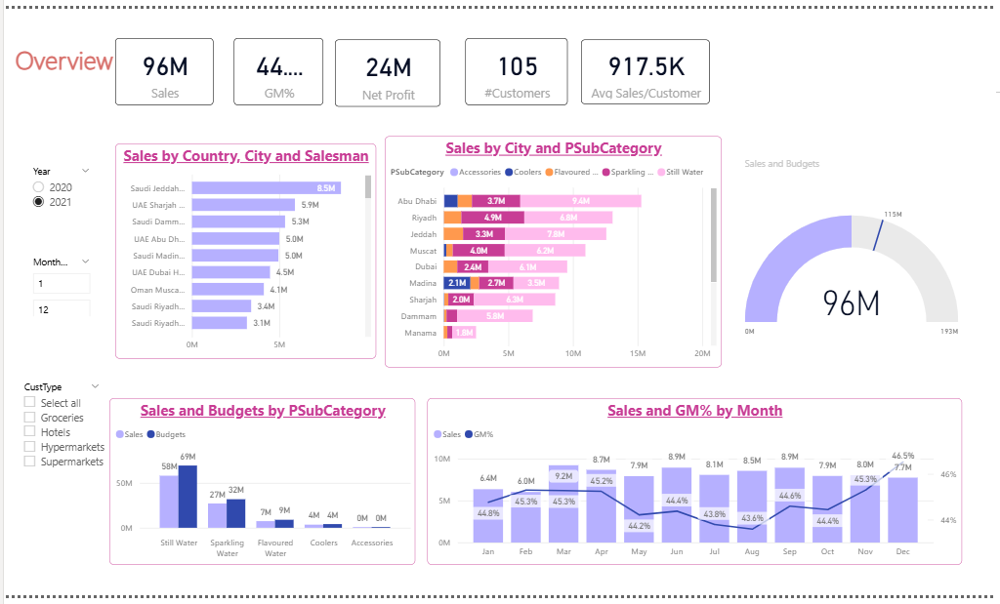

# Executive_Sales_Performance_PowerBI
Executive sales performance dashboard using Power BI with KPIs, regional analysis, and monthly trend insights

## 🔍 Overview
This project presents an executive-level sales dashboard built in Power BI to track business performance using KPIs, regional analysis, category breakdown, and monthly trends. The dashboard is designed to help decision-makers quickly evaluate performance and identify strategic opportunities.

## 🛠 Tools Used
- Power BI
- Data Visualization
- KPI Design
- Business Analysis

## 📈 Key Insights
- Monitored total sales, GM%, net profit, and customer count
- Compared sales performance across countries, cities, and salespeople
- Analyzed category and subcategory contribution to revenue
- Tracked monthly sales and GM% trends over time
- Compared sales against budget to identify performance gaps

## 📊 Dashboard Screenshots

### Executive Dashboard

## 🚀 Project Purpose
This project demonstrates how Power BI can be used to transform business data into an executive-ready dashboard that supports high-level decision-making and performance monitoring.
